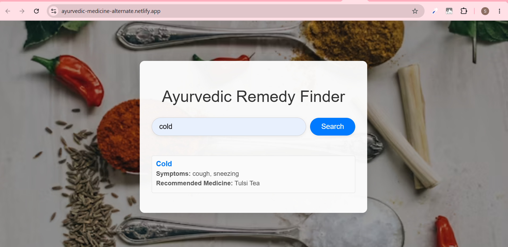

<h1 align="center">🌿 Ayurvedic Search Engine</h1>

<p align="center">
  <b>HTML • CSS • JavaScript</b>
</p>

<p align="center">
  A responsive web application for searching Ayurvedic remedies
  based on symptoms or diseases.
</p>

---
<h2>📸 Application Preview</h2>

<p align="center">
  
</p>

<p align="center">
  <i>Search Ayurvedic remedies using symptoms or diseases.</i>
</p>

---

<h2>📌 About the Project</h2>

<p>
<b>Ayurvedic Search Engine</b> is a simple web application that helps
users find Ayurvedic remedies by searching for a disease or symptom.
</p>

<p>
The application provides suggestions while typing and dynamically
filters the available remedies based on the user's search input.
</p>

---

<h2>✨ Features</h2>

<ul>
  <li>🔍 Search for remedies using diseases or symptoms</li>
  <li>💡 Autocomplete suggestions while typing</li>
  <li>⚡ Dynamic filtering based on user input</li>
  <li>📱 Responsive and mobile-friendly interface</li>
  <li>📚 Predefined Ayurvedic remedy dataset</li>
</ul>

---

<h2>🛠️ Technologies Used</h2>

<p>
  
  
  
</p>

---

<h2>📂 Project Structure</h2>

<table>
  <tr>
    <th>File / Folder</th>
    <th>Description</th>
  </tr>
  <tr>
    <td><code>src/index.html</code></td>
    <td>Main HTML document and application structure.</td>
  </tr>
  <tr>
    <td><code>src/styles.css</code></td>
    <td>Styling and responsive layout.</td>
  </tr>
  <tr>
    <td><code>src/app.js</code></td>
    <td>Search, autocomplete, filtering, and user interaction logic.</td>
  </tr>
  <tr>
    <td><code>src/data/remedies.json</code></td>
    <td>Predefined dataset of Ayurvedic remedies.</td>
  </tr>
</table>

---

<h2>🔄 How It Works</h2>

<p align="center">
  <b>User enters a symptom or disease</b>
  <br>↓<br>
  <b>Autocomplete suggestions appear</b>
  <br>↓<br>
  <b>Search input is processed</b>
  <br>↓<br>
  <b>Matching remedies are filtered</b>
  <br>↓<br>
  <b>Relevant results are displayed</b>
</p>

---

<h2>🚀 Run Locally</h2>

<h3>1. Clone the repository</h3>

```bash
git clone https://github.com/Shrutikadubey/ayurvedic_search_engine.git
```

<h3>2. Open the project</h3>

<p>
Navigate to the <code>src</code> folder and open
<code>index.html</code> in a web browser.
</p>

<p>
You can also use a local development server if preferred.
</p>

<h3>3. Search for a remedy</h3>

<p>
Enter a disease or symptom in the search field and explore the
matching suggestions and results.
</p>

---

<h2>📱 Responsive Design</h2>

<p>
The application is designed to work across different screen sizes,
including mobile devices.
</p>

---

<h2>🎯 Project Purpose</h2>

<p>
This project was created to practice frontend web development,
JavaScript-based search functionality, dynamic filtering,
autocomplete behavior, and responsive UI design.
</p>

---


<p align="center">
  <b>👩‍💻 Shrutika Dubey</b>
  <br>
  Computer Science Graduate
</p>

<p align="center">
  <i>Built with HTML, CSS & JavaScript.</i>
</p>
